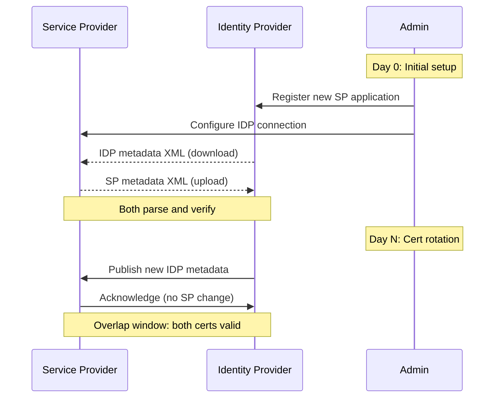
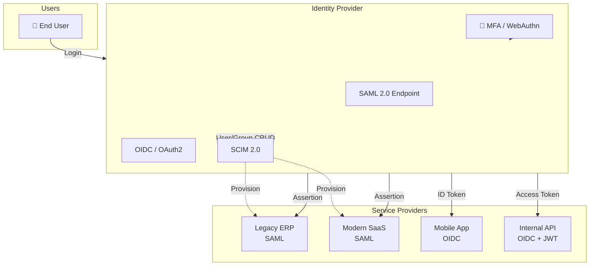

# Configuring an Identity Provider with SAML 2.0

<div class="text-lg mt-8">
  Federation, Trust, and the Reality of Single Sign-On
</div>

<div class="mt-12 text-sm opacity-70">
  Presentation as Code · Slidev · {{ $slidev.configs.theme }}
</div>

<div class="abs-br m-6 text-xs opacity-50">
  Press <kbd>Space</kbd> for next slide · <kbd>o</kbd> for overview
</div>

---
layout: two-cols
---

# Why SAML, why now?

SAML 2.0 is the **lingua franca** of enterprise federation. Even in 2026, when OIDC dominates new apps, SAML still runs the identity backbone for thousands of SaaS platforms, government systems, and legacy monoliths.

::right::

<v-clicks>

- **Federation at scale** — one IDP serves hundreds of SPs
- **Standards-based trust** — X.509 signatures, XML canonicalization
- **B2B reality** — many enterprise customers *only* speak SAML
- **Compliance driver** — audit, eIDAS, FedRAMP, gov-tech contracts
- **Loose coupling** — SPs don't need user databases

</v-clicks>

---
layout: center
---

# What we'll cover

<v-clicks>

1. 🎭 SAML in 30 seconds — the mental model
2. 🧩 Roles, assertions, bindings, profiles
3. 🔐 Trust foundation — keys, certificates, signing
4. 🤝 The configuration handshake — metadata + entityIDs
5. ⚙️ Step-by-step IDP setup (Okta, Azure AD, Keycloak)
6. 📨 Attribute mapping & NameID strategies
7. 🐛 Real-world troubleshooting
8. 🛡️ Security hardening checklist
9. 🚀 Beyond SAML — when to graduate to OIDC

</v-clicks>

---
layout: section
---

# 1 · 🎭 SAML in 30 Seconds

The mental model that makes the rest click.

---
layout: two-cols
layoutClass: gap-8
---

# Three actors, one dance

**Identity Provider (IDP)** — the source of truth for identity. Authenticates users. Signs assertions. Examples: Okta, Azure AD/Entra ID, Auth0, Ping, Keycloak, ADFS.

**Service Provider (SP)** — the application the user wants to use. Trusts the IDP to vouch for users. Examples: Salesforce, Slack, GitHub Enterprise, AWS IAM, custom apps.

::right::

**User (Principal)** — has credentials at the IDP and wants to access an SP.

The **user never gets a password** at the SP. The SP just trusts whatever the IDP says about them, as long as it's properly signed.

<div class="mt-6">

```
┌────────┐  ① AuthnRequest   ┌──────┐   ② Assertion   ┌─────┐
│   SP   │ ─────────────────▶ │ IDP  │ ─────────────▶  │User │
│        │ ◀───────────────── │      │ ◀─────────────  │     │
└────────┘   ③ Redirect w/    └──────┘   ④ SAML Resp  └─────┘
              SAMLResponse
```

</div>

---
layout: center
---

# The SAML assertion

The **assertion** is the heart of SAML — a signed XML document saying "this user, with these attributes, did authenticate at this time, by this method."

```xml {all|4-7|9-13|15-19}
<saml:Assertion xmlns:saml="urn:oasis:names:tc:SAML:2.0:assertion"
                ID="_a1234..." IssueInstant="2026-10-04T08:00:00Z"
                Version="2.0">
  <saml:Issuer>https://idp.example.com</saml:Issuer>

  <!-- A digital signature on the entire assertion -->
  <ds:Signature>...</ds:Signature>

  <saml:Subject>
    <saml:NameID Format="urn:oasis:names:tc:SAML:1.1:nameid-format:emailAddress">
      alice@example.com
    </saml:NameID>
    <saml:SubjectConfirmation Method="bearer">
      <saml:SubjectConfirmationData
        InResponseTo="_req5678"
        Recipient="https://sp.example.com/acs"
        NotOnOrAfter="2026-10-04T08:05:00Z"/>
    </saml:SubjectConfirmation>
  </saml:Subject>

  <saml:Conditions NotBefore="..." NotOnOrAfter="...">
    <saml:AudienceRestriction>
      <saml:Audience>https://sp.example.com</saml:Audience>
    </saml:AudienceRestriction>
  </saml:Conditions>

  <saml:AuthnStatement AuthnInstant="2026-10-04T08:00:00Z"
                       SessionIndex="_sess42">
    <saml:AuthnContext>
      <saml:AuthnContextClassRef>
        urn:oasis:names:tc:SAML:2.0:ac:classes:PasswordProtectedTransport
      </saml:AuthnContextClassRef>
    </saml:AuthnContext>
  </saml:AuthnStatement>

  <saml:AttributeStatement>
    <saml:Attribute Name="email"><saml:AttributeValue>alice@example.com</saml:AttributeValue></saml:Attribute>
    <saml:Attribute Name="role"><saml:AttributeValue>admin</saml:AttributeValue></saml:Attribute>
  </saml:AttributeStatement>
</saml:Assertion>
```

<div class="text-xs opacity-60 mt-2">Click lines to walk through Issuer → Signature → Subject → Conditions → Authn → Attributes.</div>

---
layout: section
---

# 2 · 🧩 The four concepts you must internalize

Roles are easy. These four are where 80% of SAML bugs hide.

---

# Concept 1 · Bindings

A **binding** = the wire format + transport for SAML messages. The same logical message can ride different transports.

| Binding | Direction | Transport | Use case |
|---|---|---|---|
| `HTTP-POST` | SP→IDP, IDP→SP | Form POST with base64 SAML in hidden field | Default for browser SSO |
| `HTTP-Redirect` | SP→IDP | 302 with `SAMLRequest` query param | AuthnRequest, LogoutRequest |
| `HTTP-Artifact` | IDP→SP | Small artifact → back-channel `<ArtifactResolve>` | Long assertions, large messages |
| `SOAP` | Either | Back-channel over HTTPS | Artifact resolution, SLO |

<v-click>

**90% of broken SAML integrations** = someone trying to POST an artifact, or redirect an assertion. Match the binding end-to-end.

</v-click>

---

# Concept 2 · Profiles

A **profile** = a complete end-to-end flow combining assertions + bindings + roles.

- **Web Browser SSO Profile** — the famous SP-initiated and IDP-initiated flows
- **Single Logout (SLO) Profile** — coordinated logout across all SPs
- **Enhanced Client or Proxy (ECP)** — non-browser clients (rare, painful)
- **Attribute Push / Pull** — let IDP send attributes proactively, or let SP query

<v-click>

**Start with SP-initiated SSO**, get it solid, then add IDP-initiated as a convenience, then *maybe* SLO. SLO is where vendor interoperability breaks down.

</v-click>

---

# Concept 3 · NameID formats

The `<saml:NameID>` is *the* primary user identifier in the assertion. Its `Format=` attribute tells the SP how to interpret it.

| Format URI | Meaning | When to use |
|---|---|---|
| `urn:oasis:names:tc:SAML:1.1:nameid-format:emailAddress` | Email | Most common, easy for SPs to display |
| `urn:oasis:names:tc:SAML:2.0:nameid-format:persistent` | Opaque, stable ID | Best — survives email/name changes |
| `urn:oasis:names:tc:SAML:1.1:nameid-format:unspecified` | Whatever IDP wants | Avoid — ambiguous |
| `urn:oasis:names:tc:SAML:2.0:nameid-format:transient` | One-time, request-scoped | Anonymous use cases only |

<v-click>

> **Pro tip:** always negotiate `persistent` if the SP supports it. Tying user identity to an email address means a user changing their email breaks their account.

</v-click>

---

# Concept 4 · Metadata

**Metadata** = a signed XML document describing a SAML entity — its entityID, signing/encryption certificates, supported bindings, endpoints.

```xml
<EntityDescriptor entityID="https://idp.example.com"
                  xmlns="urn:oasis:names:tc:SAML:2.0:metadata">
  <IDPSSODescriptor protocolSupportEnumeration="urn:oasis:names:tc:SAML:2.0:protocol">
    <KeyDescriptor use="signing">
      <KeyInfo xmlns="http://www.w3.org/2000/09/xmldsig#">
        <X509Data><X509Certificate>MIID...base64...</X509Certificate></X509Data>
      </KeyInfo>
    </KeyDescriptor>
    <SingleLogoutService Binding="urn:oasis:names:tc:SAML:2.0:bindings:HTTP-Redirect"
                        Location="https://idp.example.com/slo"/>
    <NameIDFormat>urn:oasis:names:tc:SAML:2.0:nameid-format:persistent</NameIDFormat>
    <SingleSignOnService Binding="urn:oasis:names:tc:SAML:2.0:bindings:HTTP-POST"
                        Location="https://idp.example.com/sso"/>
  </IDPSSODescriptor>
</EntityDescriptor>
```

<v-click>

**Exchange metadata, don't hand-type URLs.** One metadata file = entityID + all certs + all endpoints + all NameIDs. No copy-paste drift.

</v-click>

---
layout: section
---

# 3 · 🔐 Trust foundation

Before a single message flies, you need crypto.

---

# Certificates and signing

**Both sides need asymmetric keys.** The IDP signs assertions and AuthnResponses; the SP verifies. Optionally, the SP signs AuthnRequests and the IDP verifies.

<v-clicks>

- 🔑 **Self-signed cert is fine** — both sides explicitly trust the other's certificate via metadata. No public CA needed.
- 🔁 **Rotation is your problem** — when the cert expires (typically 1–3 years), publish new metadata *before* the cutover. Have an overlap window of at least 2 weeks.
- 📌 **At minimum, configure two things on the IDP:**
  1. The signing certificate (and key) for assertions
  2. A separate optional encryption certificate (for `<EncryptedAssertion>`)
- 🔍 **Always export the certificate as `-----BEGIN CERTIFICATE-----` PEM, without the private key, when pasting into SP config.**

</v-clicks>

---

# Signature & digest algorithms

Don't leave these at defaults blindly. As of 2026, modern SAML stacks should use:

| Purpose | Recommended | Avoid |
|---|---|---|
| Signature | `http://www.w3.org/2001/04/xmldsig-more#rsa-sha256` | `rsa-sha1` (deprecated, broken) |
| Digest | `http://www.w3.org/2001/04/xmlenc#sha256` | `sha1` |
| Encryption (optional) | `aes256-gcm` or `aes256-cbc` | `tripledes-cbc` |

<v-click>

> Old ADFS / Shibboleth defaults to SHA-1 still ship in the wild. If you're integrating with a 2014-era SP, you'll need `sha1` for compatibility, but isolate it behind a dedicated metadata profile.

</v-click>

---
layout: section
---

# 4 · 🤝 The configuration handshake

Metadata in, metadata out. URLs match. Certs match. Tests pass.

---

# The seven values that must agree

<v-clicks>

For SP-initiated SSO to work, the **IDP and SP must agree** on:

1. **SP entityID** — a URI (not necessarily resolvable), unique, persistent. Often the SP's ACS URL or a dedicated metadata URL.
2. **IDP entityID** — same idea, the IDP's identifier.
3. **Assertion Consumer Service (ACS) URL** — where the IDP POSTs the SAMLResponse.
4. **Single Sign-On Service URL** — where the SP sends the AuthnRequest.
5. **Single Logout Service URL** — optional but recommended.
6. **NameID format** — must be one both sides support.
7. **Signing certificate fingerprint or full cert** — what's used to validate signatures.

</v-clicks>

<v-click>

<div class="mt-6 text-center text-xl">

🤝 **If any one of these mismatches, login fails.** No graceful fallback. No helpful error. Just a 401 or an infinite loop.

</div>

</v-click>

---

# Metadata exchange — the right way



<v-click>

**Hot tip:** host your metadata at a stable URL (`https://idp.example.com/metadata.xml`) and pin to that. Avoid re-uploading metadata every time you rotate — let the SP pull live.

</v-click>

---
layout: section
---

# 5 · ⚙️ Step-by-step IDP setup

The same five-step recipe, three different IDPs.

---
layout: two-cols
layoutClass: gap-6
---

# Recipe for any IDP

<v-clicks>

1. **Create the SP application** in the IDP admin console. Give it a name the user will recognize.
2. **Configure SAML settings:**
   - ACS URL (paste from SP)
   - SP entityID (paste from SP)
   - NameID format (start with email, graduate to persistent)
   - Audience restriction (usually = SP entityID)
3. **Upload SP metadata OR manually paste:**
   - SP entityID, ACS URL, SLO URL
   - SP signing cert (if SP signs requests)
4. **Map attributes:**
   - `email`, `firstName`, `lastName`, `groups` → SAML attributes
5. **Assign users / groups** to the application.

</v-clicks>

::right::

<v-click>

<div class="text-center mt-12">

```
 ┌──────────────────────────┐
 │   IDP Admin Console      │
 │  ┌────────────────────┐  │
 │  │ + New App          │  │
 │  │   SAML 2.0         │  │
 │  │ ┌────────────────┐ │  │
 │  │ │ ACS URL        │ │  │
 │  │ │ EntityID       │ │  │
 │  │ │ NameID         │ │  │
 │  │ │ Attrs...       │ │  │
 │  │ └────────────────┘ │  │
 │  └────────────────────┘  │
 │  ┌────────────────────┐  │
 │  │  ▣ users assigned  │  │
 │  └────────────────────┘  │
 └──────────────────────────┘
```

</div>

</v-click>

---

# Okta

```yaml {all|1-3|5-11|13-19|21-26}
# Okta SAML app — key fields to configure
app_name: "Acme HR Portal"

general:
  app_label: "Acme HR Portal"

sign_on:
  default_relay_state: "https://hr.acme.com/login"

sso:
  sign_on_mode: "SAML 2.0"
  recipient: "https://hr.acme.com/saml/acs"
  destination: "https://hr.acme.com/saml/acs"
  audience: "https://hr.acme.com"
  issuer: "http://www.okta.com/exk8a9b3c1d2eF0g3"
  name_id_format: "urn:oasis:names:tc:SAML:1.1:nameid-format:emailAddress"
  response: "Signed"
  assertion: "Signed"
  signature_algorithm: "RSA_SHA256"
  digest_algorithm: "SHA256"

attribute_statements:
  - name: "email"
    type: "basic"
    value: "${user.email}"
  - name: "firstName"
    type: "basic"
    value: "${user.firstName}"
  - name: "lastName"
    type: "basic"
    value: "${user.lastName}"
  - name: "groups"
    type: "regex"
    value: ".*"
```

<div class="text-xs opacity-60 mt-2">Lines toggle: app meta · SAML settings · attributes · group mapping</div>

---

# Microsoft Entra ID (Azure AD)

```powershell {all|2-7|9-14|16-20}
# Azure CLI — create a SAML enterprise app
az ad app create \
  --display-name "Acme HR Portal" \
  --web-redirect-uris "https://hr.acme.com/saml/acs" \
  --identifier-uris "https://hr.acme.com" \
  --required-resource-accesses @manifest.json

# PowerShell — set SAML-specific properties
$params = @{
  IdentifierUris     = @("https://hr.acme.com")
  ReplyUrls          = @("https://hr.acme.com/saml/acs")
  PreferredSingleSignOnMode = "saml"
}
Set-MgApplication -ApplicationId $appId -BodyParameter $params

# Then in the Enterprise App blade:
#   1. Set "User assignment required" = Yes
#   2. Users and groups → Assign
#   3. Single sign-on → SAML → edit attributes
#   4. Download Federation Metadata XML → upload to SP
```

<v-click>

**Gotcha:** Entra ID's default NameID is the user's UPN (`user@tenant.onmicrosoft.com`). Map it to the email-based NameID format via the *Identifier (unique ID)* transform if your SP needs email-as-ID.

</v-click>

---

# Keycloak

```bash {all|1-5|7-12|14-18}
# Create a new realm (optional, for isolation)
kc.sh bootstrap-admin user --username admin
# Then in the admin UI: Realm Settings → Create Realm

# Export an existing client (SP) config to JSON for review
kc.sh export --realm acme --file acme-realm.json --users realm_file

# The realm export shows what you need:
# - clientId (= entityID)
# - redirectUris (= ACS URL whitelist)
# - adminUrl (= back-channel SLO)
# - attributes.saml.assertionConsumerUrl
# - attributes.saml.singleLogoutServiceUrl

# Generate SP metadata for sharing with the IDP:
#   Clients → acme-hr → Action → Download adapter config
#   Choose "SAML SP Metadata"
```

```hocon {1-15}
# realm-export.json — Keycloak SP client excerpt
"acme-hr": {
  "clientId": "https://hr.acme.com",
  "protocol": "saml",
  "redirectUris": ["https://hr.acme.com/*"],
  "attributes": {
    "saml.assertionConsumerUrl": "https://hr.acme.com/saml/acs",
    "saml.singleLogoutServiceUrl": "https://hr.acme.com/saml/slo",
    "saml.nameIdFormat": "persistent",
    "saml.signatureAlgorithm": "RSA_SHA256",
    "saml_force_name_id_format": "true"
  }
}
```

---
layout: section
---

# 6 · 📨 Attribute mapping & NameID strategies

The IDP passes user data; the SP decides what to do with it.

---

# The attribute statement, decoded

```xml
<saml:AttributeStatement>
  <saml:Attribute Name="http://schemas.xmlsoap.org/ws/2005/05/identity/claims/emailaddress"
                   NameFormat="urn:oasis:names:tc:SAML:2.0:attrname-format:uri">
    <saml:AttributeValue xsi:type="xs:string">alice@example.com</saml:AttributeValue>
  </saml:Attribute>

  <saml:Attribute Name="groups"
                   NameFormat="urn:oasis:names:tc:SAML:2.0:attrname-format:basic">
    <saml:AttributeValue xsi:type="xs:string">engineering</saml:AttributeValue>
    <saml:AttributeValue xsi:type="xs:string">oncall</saml:AttributeValue>
  </saml:Attribute>
</saml:AttributeStatement>
```

<v-clicks>

- **Two `NameFormat` flavors**:
  - `basic` — short names (`email`, `groups`). Compact, vendor-friendly.
  - `uri` — long names (Microsoft claims, OID-based). Formal, but verbose.
- **Multiple `<AttributeValue>`** elements = list/array semantics. The SP iterates.
- **Group/role membership** drives authorization — map your IDP groups to SP roles via the attribute statement.

</v-clicks>

---

# NameID strategy decision tree

<v-clicks>

```
                Which NameID format?
                       │
        ┌──────────────┼──────────────┐
        ▼              ▼              ▼
    Email-based    Persistent     Transient
        │              │              │
   User's email    Opaque ID     Request-scoped
   is the IDP ID   hashed from   unique per
        │          user GUID     assertion
        ▼              ▼              ▼
   ⚠️ Breaks if    ✅ Survives    ❌ SP can't
   user changes    email/name    identify user
   email           changes       across sessions
        │              │
        ▼              ▼
    OK for low-    Use this for
    stakes apps    production
```

</v-clicks>

<v-click>

<div class="mt-6 text-center">

**Decision:** Start with **persistent**. Fall back to **emailAddress** only if the SP doesn't support persistent. Avoid transient unless you genuinely don't want to identify users.

</div>

</v-click>

---

# Just-in-Time (JIT) provisioning

A major SAML pattern: **let the IDP create users on the SP at first login.**

<v-clicks>

- SP checks: "I don't have a user with NameID = `X`. Do they have `email`, `firstName`, etc.?"
- If yes → SP creates user, assigns roles based on attribute claims, logs them in.
- If attribute missing → SP rejects login.
- **Pros:** no separate user provisioning pipeline.
- **Cons:** user lifecycle is event-driven and hard to audit; deprovisioning needs its own mechanism (e.g., SCIM, group removals).

</v-clicks>

<v-click>

> Pair JIT with **SCIM 2.0** for lifecycle management. SCIM doesn't replace SAML — it complements it. SAML for auth, SCIM for user/group CRUD.

</v-click>

---
layout: section
---

# 7 · 🐛 Real-world troubleshooting

The five SAML errors you'll hit, and how to fix them.

---

# Error 1 · "SAML message not signed" / "Signature validation failed"

<v-click>

**Symptom:** Login redirects fine, but the SP rejects the SAMLResponse.

**Causes:**
</v-click>

<v-clicks>

- IDP configured to sign response but SP expects signed assertion (or vice versa)
- SP clock skew > 5 minutes (check `<Conditions NotBefore>` / `NotOnOrAfter`)
- Cert fingerprint mismatch — wrong cert pasted, or new cert not yet trusted
- Algorithm mismatch: IDP uses SHA-256, SP pinned to SHA-1

**Fix:**
</v-clicks>

<v-click>

- Capture the SAMLResponse with browser devtools, decode base64, inspect the `<ds:Signature>` element
- Diff what the SP expects against what the IDP sent
- Use an online SAML tracer (e.g., SAML-tracer browser extension) — non-negotiable tool

</v-click>

---

# Error 2 · "Audience does not match"

```text
SAML Response rejected: Audience 'https://wrong-sp.example.com'
does not match expected 'https://hr.acme.com'
```

<v-click>

**Fix:** the `<saml:AudienceRestriction><saml:Audience>` value must **exactly equal** the SP's entityID. No trailing slash, no `https://` vs `http://`, no path. Strings.
</v-click>

---

# Error 3 · Infinite redirect loop

<v-click>

**Symptom:** Browser keeps bouncing between IDP login and SP callback.

**Causes:**
</v-clicks>

<v-clicks>

- IDP initiates (IDP-first) but user has no session → redirects to login → after login, redirects to SP ACS → SP sees no valid SAMLResponse (because IDP-initiated doesn't have one) → redirects to IDP → infinite loop.
- AuthnRequest is malformed (wrong binding, missing `ID`) and IDP silently fails to process it.
- RelayState lost — SP sends user to a deep link, then can't reconstruct it after callback.

**Fix:** ensure your first test is **SP-initiated**, not IDP-initiated. Add logging at the SP's ACS endpoint to see what's arriving.
</v-clicks>

---

# Error 4 · "No user found / No matching attribute"

<v-click>

**Symptom:** Login succeeds at IDP, SP creates session, then says "no user" or "missing email".

**Fixes:**
</v-clicks>

<v-clicks>

- Inspect the assertion — is the `email` attribute actually there?
- Check NameID format — SP may be looking for `persistent` but IDP sent `emailAddress`
- Check attribute name casing: `email` vs `Email` vs `EMAIL` — SAML is case-sensitive
- Some IDPs require attribute statement `NameFormat` to match SP expectation

</v-clicks>

---

# Error 5 · Clock skew causing NotOnOrAfter rejection

<v-click>

```
saml:Assertion rejected: NotOnOrAfter '2026-10-04T08:05:00Z' is in the past
(current server time: 2026-10-04T08:08:23Z)
```

</v-click>

<v-click>

**Cause:** 3-minute clock drift between IDP server and SP server. SAML assertions typically have a 5-minute window. Anything more and they're invalid on receipt.

**Fixes:**
</v-clicks>

<v-clicks>

- Run NTP on both sides. Time skew should be < 30 seconds.
- Many SPs allow configuring "clock skew tolerance" (bump to 60–120 seconds).
- Never extend `<NotOnOrAfter>` past 5 minutes without a security review.

</v-clicks>

---

# The troubleshooting toolkit

<v-clicks>

- 🧪 **SAML-tracer** (Firefox/Chrome extension) — captures every SAML message in the browser
- 🔬 **[samltool.io](https://samltool.io)** — decode, validate, and inspect SAML XML
- 🪛 **OneLogin's SAML tester** — paste IDP metadata, simulate SP behavior
- 🐛 **Browser devtools** — Network tab → filter `saml` → see the actual POST
- 📋 **`xmllint --format`** — pretty-print the decoded response
- ⏱️ **`curl -v` + NTP check** — verify cert chain and clock before chasing the XML

</v-clicks>

---
layout: section
---

# 8 · 🛡️ Security hardening

SAML done wrong is a single point of total compromise. Hardening is not optional.

---

# The SAML security checklist

<v-clicks>

- ✅ **Sign the response AND the assertion** — belt and suspenders
- ✅ **Reject unsigned AuthnRequests** at the IDP unless the SP explicitly requires otherwise
- ✅ **Use SHA-256, never SHA-1** for signing and digest
- ✅ **Validate `InResponseTo`** on every assertion to prevent replay
- ✅ **Enforce `NotBefore` and `NotOnOrAfter`** — never accept assertions outside the validity window
- ✅ **Validate `Recipient`** matches your ACS URL exactly
- ✅ **Enforce HTTPS** on every endpoint — no HTTP fallback
- ✅ **Encrypt assertions** (`<EncryptedAssertion>`) when transporting sensitive attributes
- ✅ **Sign metadata** so consumers can detect tampering
- ✅ **Rotate signing certs** at least yearly, with a documented overlap window
- ✅ **Audit log every assertion** — issuer, subject, timestamp, source IP, attributes

</v-clicks>

---

# Common SAML attack vectors

<v-clicks>

- 🎯 **XML Signature Wrapping (XSW)** — attacker wraps a legitimate assertion inside extra XML elements; the signature validates, but the SP reads the *wrong* assertion. Mitigated by modern SAML libraries; still check yours.
- 🎯 **Signature stripping** — attacker removes the `<ds:Signature>` and SPs that don't require signed assertions fall for it. Mitigation: enforce signing at the SP.
- 🎯 **Replay attacks** — attacker captures a valid assertion and replays it. Mitigated by `NotOnOrAfter`, `InResponseTo` validation, and one-time use tracking.
- 🎯 **Open redirect / XSS via RelayState** — RelayState is reflected back to the browser. Validate it strictly against an allowlist before redirecting.
- 🎯 **SSRF via `<AssertionConsumerServiceURL>`** — make sure the SP rejects AuthnRequests with attacker-controlled ACS URLs.

</v-clicks>

---
layout: section
---

# 9 · 🚀 Beyond SAML

SAML isn't the end of the story — it's the foundation.

---

# When to stay with SAML

<v-clicks>

- 🏛️ **Enterprise B2B SaaS** — customers expect SAML; OIDC isn't enough
- 🏛️ **Government / regulated** — eIDAS, FedRAMP, many frameworks mandate SAML
- 🏛️ **Legacy SPs** — that vendor still on Java 8 with Shibboleth 2.x
- 🏛️ **Attribute-heavy authz** — SAML's `<AttributeStatement>` is more expressive than OIDC's claims for complex group/role maps

</v-clicks>

---

# When to add OIDC alongside

<v-clicks>

- 🚀 **Modern web/mobile apps** — OIDC's JSON+JWT is simpler than XML+base64
- 🚀 **API-first services** — JWT bearer tokens work natively with HTTP APIs
- 🚀 **Mobile deep linking** — OIDC's `redirect_uri` flows handle native app schemes better
- 🚀 **Microservices** — JWTs propagate identity between services without a SAML XML parse at every hop

</v-clicks>

<v-click>

**Most enterprises end up running both.** SAML for legacy/enterprise federation, OIDC for modern apps. The IDP (Okta, Entra ID, Auth0, Keycloak) presents SAML to the old world and OIDC to the new.

</v-click>

---

# The hybrid identity stack



---
layout: center
---

# Key takeaways

<v-clicks>

- 🧠 **SAML is a trust contract.** entityIDs, certificates, and URLs must all agree. Exchange metadata; don't hand-type.
- 🔐 **Signing is non-negotiable.** Sign responses *and* assertions; use SHA-256; rotate certs yearly.
- 🎯 **Pick the right NameID.** Persistent when possible; email only when forced.
- 📨 **Attributes drive authz.** Map groups to roles via the attribute statement; consider JIT + SCIM.
- 🐛 **Test SP-initiated first.** Always use SAML-tracer. Always sync clocks.
- 🛡️ **Hardening is mandatory.** Validate `Recipient`, `InResponseTo`, `NotOnOrAfter`. Reject unsigned.
- 🚀 **SAML and OIDC coexist.** Most enterprises run both. SAML for the legacy and the regulated, OIDC for the modern.

</v-clicks>

---
layout: end
---

# Thanks 🙏

Questions? Let's dig into metadata XML.

<div class="text-sm mt-8 opacity-70">

📚 Resources

- [OASIS SAML 2.0 spec](https://docs.oasis-open.org/security/saml/v2.0/)
- [SAML-tracer extension](https://addons.mozilla.org/en-US/firefox/addon/saml-tracer/)
- [samltool.io decoder](https://samltool.io)
- [OWASP SAML Security Cheat Sheet](https://cheatsheetseries.owasp.org/cheatsheets/SAML_Security_Cheat_Sheet.html)

</div>
